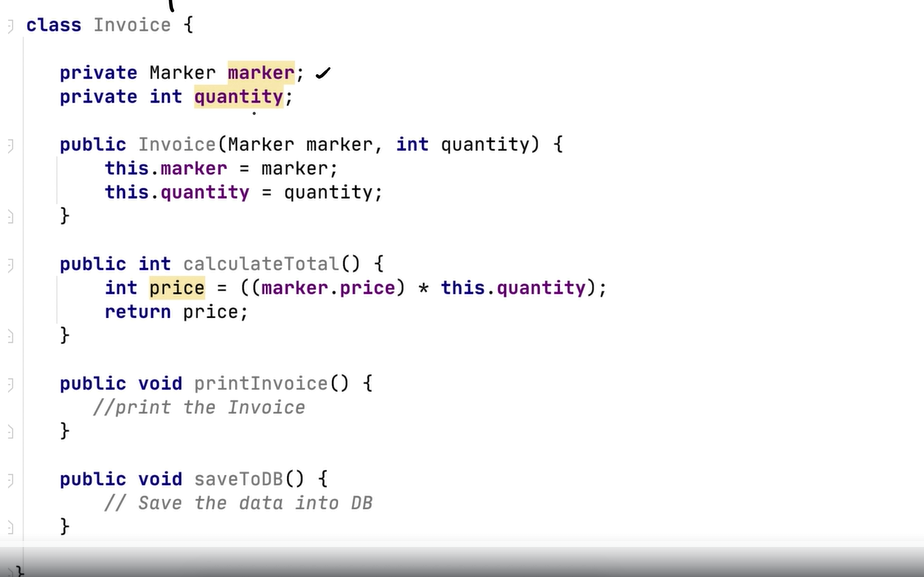
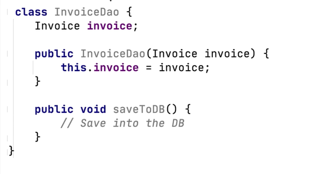
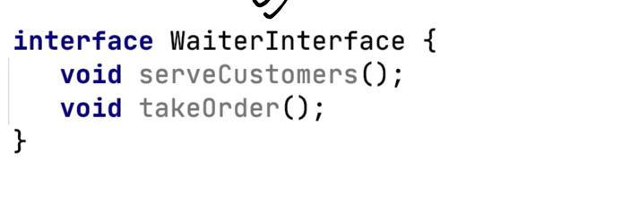
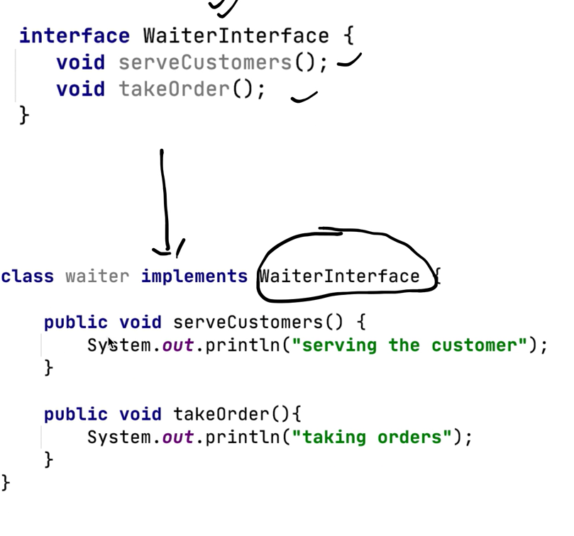

# Solid Principles of OOPS - 

| S  | Single Responsibility Principle   |
| ------------ | ------------ |
|  O | Open / Close Principle   |
| L  |  Liskov Substituion Principle |
|  I |   Interface Segregation Principle|
|  D |  Dependency Inversion Principle |

**Advantages of following these Principles :**
> Help us to write better code:
1. Avoid Duplicate Code
2. Easy to maintain
3. Easy to Understand
4. Flexible software
5. Reduce Complexity

##  S - Single Responsiblity Principle
> A Class should have only 1 reason to change.

Here we have Marker Entity and it has property - name, color, year, price.

And this is Invoice class with methods - calculateTotalPrice, printInvoice, saveToDB.

> Now suppose if we change the printing logic, then we have to change the Invoice class.  
**Reason 1**

> Now, if we have to add a discount or taxes to the price then we have to change the logic of calculateTotalPrice method and this will result in changing the Invoice class.  
**Reason 2**

> And if we have to save the invoice to the database then we have to change the logic of saveToDB method and this will result in changing the Invoice class.   
**Reason 3**

So from the above example, we can say that the Invoice class has multiple reasons to change and this is not a good practice.

But Single Responsibility Principle says that a class should have only 1 reason to change. So, we should have separate classes for each responsibility.

> This is for calculating the total price of the invoice.

> This is for saving the invoice to the database.

> This is for printing the invoice.

**Following the Single Responsibility Principle -**
1. Easy to maintain
2. Easy to Understand

##  O - Open / Close Principle
> A class should be open for extension but closed for modification.

Suppose we have **InvoiceDao** class and it has a method **saveToDB** which saves the invoice to the database, and this class is live and getting traffic from the users.

And suppose a requirement came to save the invoice to the file too - 

and we added a method **saveToFile** to the **InvoiceDao** class, so we are changing the existing tested class and this is not a good practice it may result in breaking the existing functionality.

**Open / Close Principle says that a class should be open for extension but closed for modification. So, we should not modify the existing class, instead, we should create a new class for the new requirement or we can create an interface and implement it in the new class.**

> This is the interface for saving the invoice.

Here we created the InvoiceDao interface and implemented it in the **DatabaseInvoiceDao** class and **FileInvoiceDao** class.

##  L - Liskov Substitution Principle
> Objects of a superclass shall be replaceable with objects of its subclasses without affecting the functionality of the program.

> Means, If Class B is subtype of Class A, then we should be able to replace object of A with B without breaking the behaviour of the program.

> Subclass should extend the capability of the parent class, not narrow it down.

 

Suppose we have Bike class and it has a method **turnOnEngine** and **accelerate**.
- now we created the object of bike, ie **MotorCycle** and it has a method **turnOnEngine** and **accelerate**, turning on the engine make the engine on and accelerating the bike.

- now we created another class, ie **Bicycle** and it has a method **accelerate** and **turnOnEngine**. But turning on the engine throws Assertion Error - **"there is no engine"**, engine does not make any sense in the bicycle class.

>Now understand suppose till then bike class was receving the object of MotorCycle and it was working fine, but now we are passing the object of Bicycle class, then it will throw an error.

So, here we changed the behaviour of the program by replacing the object of the superclass with the object of the subclass, which inverts the Liskov Substitution Principle.

## Eg: 2
Now suppose we have a class **Rectangle** and it has a method **setHeight** and **setWidth**.

And we have a class **Square** which extends the **Rectangle** class and it has a method **setSide**.

Now, if we create an object of **Rectangle** class and set the height and width, then the area will be height * width.

And if we create an object of **Square** class and set the side, then the area will be side * side.

So, the area of the **Square** class is different from the **Rectangle** class.

**Liskov Substitution Principle says that objects of a superclass shall be replaceable with objects of its subclasses without affecting the functionality of the program.**

> So, we should not create a subclass that narrows down the functionality of the parent class.

##  I - Interface Segregation Principle
> Interfaces should be such that the client should not be forced to implement unnecessary functions 

> A client should never be forced to implement an interface that it does not use.

Here we have interface RestaurantEmployee and it has methods - washDishes, serveCustomers, cookFood.

Now Class Waiter implements the RestaurantEmployee interface and it have to implement all the methods of the interface. ie washDishes, serveCustomers, cookFood.

But, Waiter does not cook food, so it should not implement the cookFood method.

here the client is Waiter and it is forced to implement the cookFood method which is unnecessary.

> So, we should break down the interface into parts, so that the client should not be forced to implement unnecessary functions.

> Now WaiterInterface is trimmed down to only the methods that are necessary for the Waiter class.

## Eg:2

According to the interface segregation principle, you should
break down “fat” interfaces into more granular and specific
ones. Clients should implement only those methods that they
really need. Otherwise, a change to a “fat” interface would
break even clients that don’t use the changed methods.

Class inheritance lets a class have just one superclass, but it doesn’t limit the number of interfaces that the class can implement at the same time. Hence, there’s no need to cram tons of unrelated methods to a single interface. Break it down into several more refined interfaces—you can implement them all in a single class if needed. However, some classes may be fine with implementing just one of them.

>This is bloated interface -  

>Better way is break down the interface into parts. 

##  D - Dependency Inversion Principle
> Class should depend on interfaces rather than concrete classes.

> High-level classes shouldn’t depend on low-level classes. Both should depend on abstractions. Abstractions shouldn’t depend on details. Details should depend on abstractions.

Usually when designing software, you can make a distinction
between two levels of classes.
- Low-level classes implement basic operations such as working
with a disk, transferring data over a network, connecting to a
database, etc.

- High-level classes contain complex business logic that directs
low-level classes to do something.

----
Suppose we have two interfaces - 
>Keyboard <Interface>

>Mouse <Interface>

And we have a class Macbook - 

here Macbook class is dependent on the concrete classes of Keyboard and Mouse, ie WiredKeyboard() and WiredMouse().
>But according to the Dependency Inversion Principle, a class should depend on interfaces rather than concrete classes.

So, what we will do is we will create an interface for Keyboard and Mouse and pass these as constructor injection to the Macbook class.

This will ensure that the Macbook class is not dependent on the concrete classes of Keyboard and Mouse, instead, it is dependent on the interfaces of Keyboard and Mouse.

----
This is SOLID Prinicples of OOPS.
Using these principles we can - 
1. Avoid Duplicate Code
2. Easy to maintain
3. Easy to Understand
4. Flexible software
5. Reduce Complexity

---
$$
ThanksForReadingIfYouLikedItPleaseSubscribeMyNewsLetter!
$$

